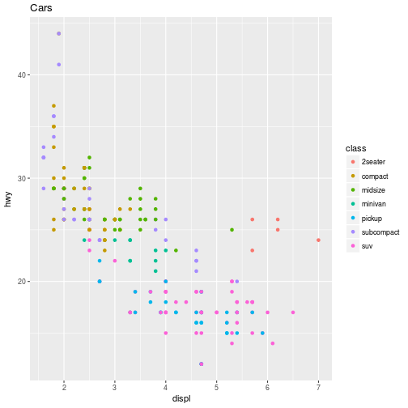

Now i am  startign to replicate daniel hadely code found [here](http://danielphadley.com/ggplot-Logo/)


here we go


let' first load the required libraries


```r
library(ggplot2)
library(magick)
library(magrittr)
```

Let's make the ggplot first


```r
ggplot(mpg, aes(displ, hwy, colour = class)) + 
  geom_point() + 
  ggtitle("Cars")  + 

  ggsave(filename=paste0("./FIGURES/",last_plot()$labels$title,".png"),
	width=5, height=4, dpi=300 
	 )
```



Now time to read the saved image


```r
plot <- image_read("./FIGURES/Cars.png")
```

Now let's bring in a logo


```r
logo_raw <- image_read("http://hexb.in/hexagons/ggplot2.png") 
image_write(logo_raw,"./FIGURES/logo.png")
```

now i will show different transformation, it could have been done in one go by piping but went ahead and did it break down for better understanding

first up scaling


```r
logo_raw <- image_read("./FIGURES/logo.png")
logo_raw %>% 
    image_scale("100") %>% 
    image_write("./FIGURES/logo_scle.png")
```

Original figure was   

after rescaling, we end up with


basically the above will rescale the image into width of 100px and height will change accordingly


now changing the background


```r
logo_raw %>% 
    image_background("grey", flatten=TRUE) %>% 
    image_display()
```

```
  format width height colorspace filesize
1    PNG   181    210       sRGB        0
```

now time to add some border


```r
logo_raw %>% 
    image_border("grey", "50x20") %>% 
    image_display()
```

```
  format width height colorspace filesize
1    PNG   281    250       sRGB        0
```

the above is pretty obvious, grey back ground with 50px left and right, 20px top and bottom, now let try different border for different sides


```r
logo_raw %>% 
    image_border("grey", "20x10x30x10") %>% 
    image_display()
```

```
  format width height colorspace filesize
1    PNG   221    230       sRGB        0
```

ah great it just works, awesome

now time to add some text


```r
logo_raw %>% 
    image_border("grey","50x30") %>% 
    image_background("grey", flatten=TRUE) %>% 
    image_annotate("R magick",size=30, color="red") %>% 
    image_display()
```

```
  format width height colorspace filesize
1    PNG   281    270       sRGB        0
```

let's check out position of the text, by default it starts from top left. Let's say we want to put it in the bottom left. there is the option called "gravity". 


```r
logo_raw %>% 
    image_border("grey","50x30") %>% 
    image_background("grey", flatten=TRUE) %>% 
    image_annotate("R magick",
		   size=30, 
		   color="red",
		   gravity="southwest") %>% 
    image_display()
```

```
  format width height colorspace filesize
1    PNG   281    270       sRGB        0
```


apart from "gravity" there is another option called location, which we are going to try next


```r
logo_raw %>% 
    image_border("grey","50x30") %>% 
    image_background("grey", flatten=TRUE) %>% 
    image_annotate("R magick",
		   size=30, 
		   color="red",
		   degrees=60,
		   location="+100+150") %>% 
    image_display()
```

```
  format width height colorspace filesize
1    PNG   281    270       sRGB        0
```

first look at the option of location. it is the x-axis and y-axis coordinates from the topleft. so y-axis positive value actually goes down.  it may change with the gravity option. 

degree option changes angle, postive and negative both values will work. 

Next up we will see how to combine the logo with the main plot, animation and then incorporate gif in a plot. 

